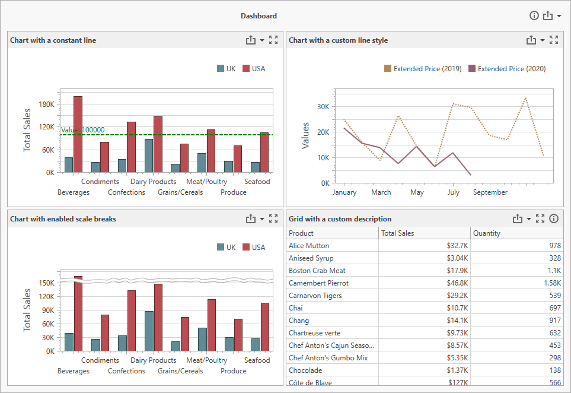

*Files to look at*:
- [Modules](./CS/Wpf-Dashboard-Custom-Properties/Modules)
- [MainWindow.xaml](./CS/Wpf-Dashboard-Custom-Properties/MainWindow.xaml)

# WPF Dashboard Control - Custom Properties

The example shows how to add custom properties to the WPF Dashboard Control. 

## Overview

Custom properties are stored in a CustomProperties collection in a structured format. Each custom property in this collection contains the custom property's metadata.

To customize the underlying control, you can change the dashboard item's style according to the custom property value.

The example contains the following custom properties organized into modules:

### DashboardDescriptionModule
This module enables you to display a dashboard description. The dashboard description is displayed when you click the info button in the dashboard title.

### ItemDescriptionModule
This module enables you to display a description for a dashboard item. The description is displayed when you click the info button in the dashboard item caption.

### ChartItemModule

This module contains three custom properties for a Chart dashboard item.

#### Chart Scale Break
The ScaleBreak class displays scale breaks for the Chart dashboard item if the Chart's custom property is _true_.

#### Chart Line Stye
The LineStyle class changes the line style according to the custom property value. In this example, it is a _dot_.

#### Chart Constant Line
The ConstantLine class allows you to display a constant line for the selected Chart item. The property contains information about a pane, axis type (primary or secondary), and a value.

## See Also
- [WinForms Dashboard - Custom Properties](https://github.com/DevExpress-Examples/winforms-dashboard-custom-properties)
- [ASP.NET MVC Dashboard - Custom Properties](https://github.com/DevExpress-Examples/asp-net-mvc-dashboard-custom-properties-sample)