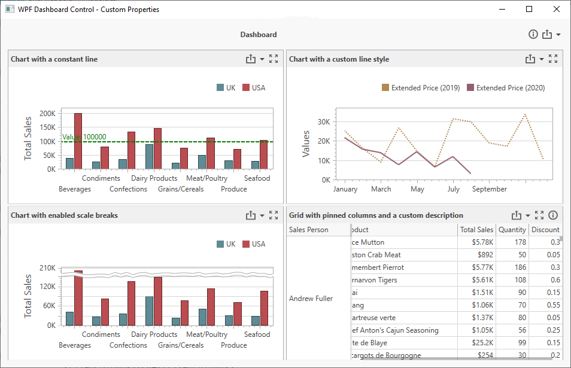

<!-- default badges list -->

<!-- default badges end -->

# Dashboard for WPF - Custom Properties

The example shows how to add custom properties to the WPF Dashboard Control. 

## Files to Review
- [Modules](./cs/Wpf-Dashboard-Custom-Properties/Modules)
- [MainWindow.xaml](./cs/Wpf-Dashboard-Custom-Properties/MainWindow.xaml)

## Overview

Custom properties are stored in a CustomProperties collection in a structured format. Each custom property in this collection contains the custom property's metadata.

To customize the underlying control, you can change the dashboard item's style and template according to the custom property value.

The example contains the following custom properties organized into modules:

### DashboardDescriptionModule

[View Module](./cs/Wpf-Dashboard-Custom-Properties/Modules/DashboardDescriptionModule)

This module enables you to display a dashboard description. The dashboard description is displayed when you click the info button in the dashboard title.

### ItemDescriptionModule

[View Module](./cs/Wpf-Dashboard-Custom-Properties/Modules/ItemDescriptionModule)

This module enables you to display a description for a dashboard item. The description is displayed when you click the info button in the dashboard item caption.

### GridFixedColumnModule

[View Module](./cs/Wpf-Dashboard-Custom-Properties/Modules/GridFixedColumnModule)

This module pinned columns in a Grid dashboard item.

### ChartItemModule

[View Module](./cs/Wpf-Dashboard-Custom-Properties/Modules/ChartItemModule)

This module contains three custom properties for a Chart dashboard item:

- **Chart Scale Break**

    The ScaleBreak class displays scale breaks for the Chart dashboard item if the Chart's custom property is _true_.

- **Chart Line Style**

    The LineStyle class changes the line style according to the custom property value. In this example, it is a _dot_.

- **Chart Constant Line**

    The ConstantLine class allows you to display a constant line for the selected Chart item. The property contains information about a pane, axis type (primary or secondary), and a value.

## Documentation

- [Customization](https://docs.devexpress.com/Dashboard/401789/wpf-viewer/customization)
- [A List of Styles and Templates](https://docs.devexpress.com/Dashboard/400142/wpf-viewer/a-list-of-styles-and-templates)

## More Examples
- [ASP.NET MVC Dashboard Control - Custom Properties](https://github.com/DevExpress-Examples/asp-net-mvc-dashboard-custom-properties-sample)
- [ASP.NET Web Forms Dashboard Control - Custom Properties](https://github.com/DevExpress-Examples/asp-net-web-forms-dashboard-custom-properties-sample)
- [ASP.NET Core Dashboard Control - Custom Properties](https://github.com/DevExpress-Examples/asp-net-core-dashboard-custom-properties-sample)
- [Dashboard Component for Angular - Custom Properties](https://github.com/DevExpress-Examples/angular-with-asp-net-core-dashboard-custom-properties-sample)
- [WinForms Dashboard Designer - Custom Properties](https://github.com/DevExpress-Examples/winforms-dashboard-custom-properties)
- [Multiplatform Example - Constant Lines](https://github.com/DevExpress-Examples/dashboard-constant-lines)
